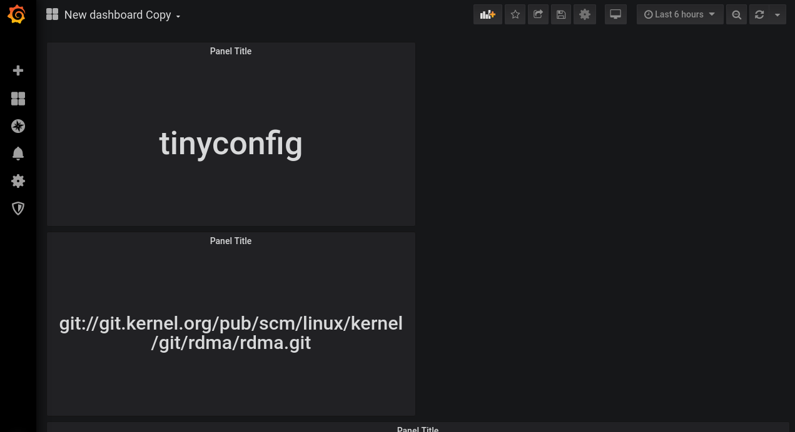

# Singlevalue Grafana plugin

This plugin is similar to the `singlestat` plugin, with two
differences:

* The value shown is a link, not just plain text.
* Otherwise, this plugin has fewer features and is simpler than `singlestat`.




## Maintainers

Esteban Manchado Velázquez <esteban@redhat.com> (primary) and Nikolai
Kondrashov <nikolai.kondrashov@redhat.com> (secondary).

## Design principles

This plugin should be familiar to Grafana users (eg. it looks similar
to Singlestat and supports a small subset of the `${__cell*}` syntax
in Table), but should be as simple as possible. Most of the code is in
the `SingleValueCtrl` class in `src/singlevalue_ctrl.js`.

## Development

To develop this plugin you need a Grafana installation. It's easy to
get one with Docker. To make it easier to develop it is better if you
use a Docker volume. You can do so by running the following commands:

```
docker volume create grafana-storage
docker run -d -p 127.0.0.1:3001:3000 -e GF_INSTALL_PLUGINS="<WHICHEVER_PLUGINS_YOU_NEED>" -v grafana-storage:/var/lib/grafana --name grafana grafana/grafana:6.6.0
```

Other plugins you might need to install are data sources,
eg. `doitintl-bigquery-datasource`. The Docker volume files will be
under `/var/lib/docker/volumes/grafana-storage`, so you can install
the plugin code there and start developing.

### How to test

Create a new dashboard and then a new panel. The panel should be a
visualization, and the type should be "Singlevalue panel". Then input
your query and set appropriate values for the "Text template" and "URL
template" fields. Usually these will be static values, or the special
macro `${__cell_XXX}`, where `XXX` is the 0-based column index (only
the first result of the query will be considered).

Short testing checklist:

* Go through every configuration value, changing it and checking that
the changes produce the desired results.
* Check that leaving the URL empty will remove the link and leave the
  text.

### Making a release

To make a new release, update the `version` field in `plugin.json`,
tag the release, then upload a ZIP with the new release to GitLab.

To make a release ZIP file, type `grunt zip`. That will leave a file
called `grafana-singlevalue-panel-VERSION.zip` in the current
directory.
